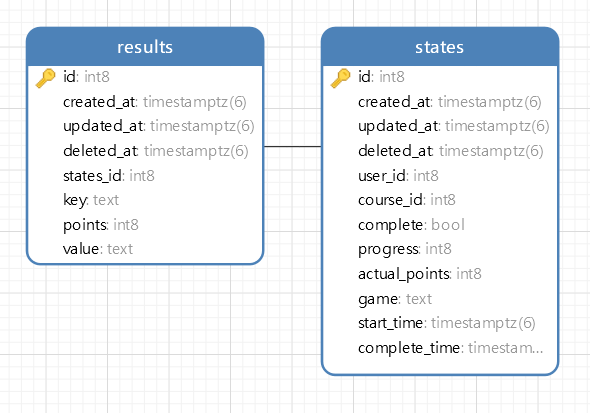

# Gamificacion API

_Bienvenido a Gamificacion API para el programa de atraccion de talentos en la UDP, aca encontraras la informacion nesesaria para poder interactuar con esta API._

## IMPORTANTE

_Todas las peticiones correctas tienen el estado HTTP 200, el resto serán consideradas erroneas o inconsistentes._


## ESQUEMA



## Rutas

_En el presente apartado se veran las rutas para poder obtener, ingresar, modificar o eliminar elementos de la base de datos._

### /

_Ruta del blockly offline, para poder hacer las pruebas de las respuestas de forma local, EXCLUSIVO DE USO LOCAL_

### completetime

_Ruta para poder asignar el CompleteTime (PATCH). Recibiendo como parametro el UserID y el CourseID (campos obligatorios), funciona como find/create._


HTTP Request (PATCH)
```
/completetime
```

Parametros

* user_id (int, obligatorio, unico) y course_id (int, obligatorio, unico): Recibe un (y solo uno) user_id y course_id como parametro Asignando el CompleteTime a la hora actual.

Ejemplo

PETICION 1: (PATCH)

 ```
 /completetime?user_id=1&course_id=1
 ```

HTTP 200 OK.

### setprogress

_Ruta para poder asignar el Progress (PATCH). Recibiendo como parametro el UserID, el CourseID y Progress (campos obligatorios), funciona como find/create._


HTTP Request (PATCH)
```
/setprogress
```

Parametros

* user_id (int, obligatorio, unico), course_id (int, obligatorio, unico), progress (int, obligatorio, unico): Recibe un (y solo uno) user_id, course_id y progress como parametro. Asignando el Progress del parametro al usuario.
Ejemplo

PETICION 1: (PATCH)

 ```
 /setprogress?user_id=1&course_id=1&progress=1
 ```

HTTP 200 OK.

### setcomplete

_Ruta para poder asignar el Complete (PATCH). Recibiendo como parametro el UserID, el CourseID y Complete (campos obligatorios), funciona como find/create._


HTTP Request (PATCH)
```
/setcomplete
```

Parametros

* user_id (int, obligatorio, unico), course_id (int, obligatorio, unico), complete (bool, obligatorio, unico): Recibe un (y solo uno) user_id, course_id y complete como parametro. Asignando el Complete del parametro al usuario.
Ejemplo

PETICION 1: (PATCH)

 ```
 /setcomplete?user_id=1&course_id=1&complete=true
 ```

HTTP 200 OK.

### setgame

_Ruta para poder asignar el Game (PATCH). Recibiendo como parametro el UserID, el CourseID y Game (campos obligatorios), funciona como find/create._


HTTP Request (PATCH)
```
/setgame
```

Parametros

* user_id (int, obligatorio, unico), course_id (int, obligatorio, unico), game (string, obligatorio, unico): Recibe un (y solo uno) user_id, course_id y game como parametro. Asignando el Game del parametro al usuario.
Ejemplo

PETICION 1: (PATCH)

 ```
 /setgame?user_id=1&course_id=1&game=puzzle
 ```

HTTP 200 OK.

### setactualpoints

_Ruta para poder asignar el ActualPoints (PATCH). Recibiendo como parametro el UserID, el CourseID y Points (campos obligatorios), funciona como find/create._


HTTP Request (PATCH)
```
/setactualpoints
```

Parametros

* user_id (int, obligatorio, unico), course_id (int, obligatorio, unico), points (int, obligatorio, unico): Recibe un (y solo uno) user_id, course_id y points como parametro. Asignando el ActualPoints del parametro al usuario.
Ejemplo

PETICION 1: (PATCH)

 ```
 /setactualpoints?user_id=1&course_id=1&points=20
 ```

HTTP 200 OK.

### deletestates

_Ruta para poder eliminar un state (DELETE). Recibiendo como parametro el ID (campo obligatorio)._


HTTP Request (DELETE)
```
/deletestates
```

Parametros

* id (int, obligatorio, unico): Recibe un (y solo uno) id como parametro. Eliminando la columna con esa ID.
Ejemplo

PETICION 1: (DELETE)

 ```
 /deletestates?id=1
 ```

HTTP 200 OK.

### insertstate

_Ruta para poder agregar un state (POST). Recibiendo un body en formato json._


HTTP Request (POST)
```
/insertstate
```

BODY FORMATO:

```json
    {
        "UserID": 0,
        "CourseID": 0,
        "Complete": false,
        "Progress": 0,
        "ActualPoints": 0,
        "Game": ""
    }
```

PETICION 1: (POST)

```json
    {
        "UserID": 1,
        "CourseID": 1,
        "Complete": false,
        "Progress": 0,
        "ActualPoints": 0,
        "Game": "puzzle"
    }
```

HTTP 200 OK.

### courseranking

_Ruta para poder obtener la lista de usuarios con sus respectivo puntaje ordenada de mayor a menor (GET). Recibiendo como parametro el CourseID (campo obligatorio).


HTTP Request (GET)
```
/courseranking
```

Parametros

* course_id (int, obligatorio, unico): Recibe un (y solo uno) course_id como parametro. Obteniendo un arreglo de json que tienen el usuarios y puntajes de cada uno, ordenada por puntaje.
Ejemplo

PETICION 1: (GET)

 ```
 /courseranking?course_id=1
 ```

```json
    [
        {
            "UserID": 1,
            "ActualPoints": 243
        },
        {
            "UserID": 1,
            "ActualPoints": 0
        }
    ]
```

### setanswer

_Ruta para poder asignar una respuesta de algun juego de blockly-games (POST), recibe un Body que contiene, el UserID, CourseID, Key, Value. Este metodo hace la creacion de un elemento en la BD de tipo Result haciendo el calculo de puntaje respectivo y en caso de que sea una respuesta nueva (valida) o una mejor, actualiza el State asociado._


HTTP Request (POST)
```
/setanswer
```

BODY FORMATO:

```json
    {
        "UserID": 0,
        "CourseID": 0,
        "Key": "",
        "Value": ""
    }
```

PETICION 1: (POST)

```json
    {
        "UserID": 1,
        "CourseID": 1,
        "Key": "maze2",
        "Value": "<xml xmlns=\"https:\/\/developers.google.com\/blockly\/xml\"><block type=\"maze_moveForward\"><next><block type=\"maze_turn\"><field name=\"DIR\">turnLeft<\/field><next><block type=\"maze_moveForward\"><next><block type=\"maze_turn\"><field name=\"DIR\">turnRight<\/field><next><block type=\"maze_moveForward\"><\/block><\/next><\/block><\/next><\/block><\/next><\/block><\/next><\/block><\/xml>"
    }
```

HTTP 200 OK.

## Construido con 🛠

_Esta API fue programada usando las siguientes herramientas_

* [Golang](https://golang.org/) - El lenguaje utilizado.
* [Gorm](https://gorm.io/) - Para interactuar con la BD.
